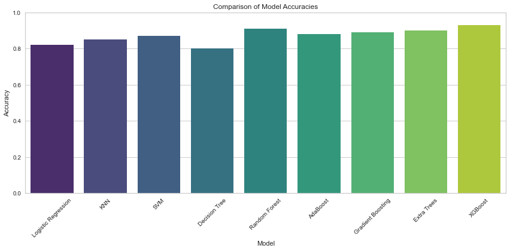

# Heart Disease Prediction using Machine Learning

## 📌 Project Overview

This project uses machine learning models to predict the presence of heart disease based on clinical and demographic patient data. The Cleveland Heart Disease dataset from the UCI repository was used to train and evaluate nine different models.

## 🙋‍♂️ Author
 Shubham Kumar  
 Intern at  Foundations of AI
 From 10 April 2025 to 10 May 2025, a Microsoft initiative
 Implemented by Edunet Foundation
 In collaboration with
 All India Council for Technical Education (AICTE)

## 🎯 Objective
To apply supervised machine learning algorithms on clinical data to predict the likelihood of heart disease and compare model performance.

---

## 🧠 Models Implemented
- Logistic Regression  
- K-Nearest Neighbors (KNN)  
- Support Vector Machine (SVM)  
- Decision Tree  
- Random Forest  
- AdaBoost  
- Gradient Boosting  
- Extra Trees  
- XGBoost

---

## 🧰 Tech Stack

- **Language:** Python 3.x  
- **IDE:** Jupyter Notebook  
- **Libraries:** 
  - Data Handling: `pandas`, `numpy`
  - Visualization: `matplotlib`, `seaborn`, `plotly`
  - Machine Learning: `scikit-learn`, `xgboost`
  - Model Diagnostics: `yellowbrick`

---

## 📊 Dataset

- **Name:** Cleveland Heart Disease Dataset  
- **Source:** [UCI ML Repository](https://archive.ics.uci.edu/ml/datasets/heart+Disease)

---

## ⚙️ Project Workflow

1. **Data Cleaning & Preprocessing**  
   - Handled missing values  
   - Encoded categorical features  
   - Normalized numerical features

2. **Model Building**  
   - Split dataset into training & test sets  
   - Performed hyperparameter tuning  
   - Evaluated models using accuracy, confusion matrix, classification report

3. **Result Comparison**  
   - XGBoost achieved the best accuracy among all models.

---

## 📌 Results

---

## ✅ Conclusion

Ensemble models like XGBoost provided superior accuracy and performance in predicting heart disease. The project demonstrates that machine learning can significantly assist in early diagnosis and preventive treatment planning.

---

## 🚀 Future Scope

- Use larger and more diverse datasets  
- Deploy as a real-time web/mobile app  
- Integrate deep learning models  
- Collaborate with healthcare providers for real-world testing

---

## 🔗 References

- [Kaggle Dataset](https://www.kaggle.com/datasets/redwankarimsony/heart-disease-data)  
- [UCI Dataset](https://archive.ics.uci.edu/ml/datasets/heart+Disease)  
- [Scikit-learn Docs](https://scikit-learn.org/stable/user_guide.html)  
- [GitHub Repository](https://github.com/Shub202/AI-Heart-Disease-Prediction-Using-ML-.git)
